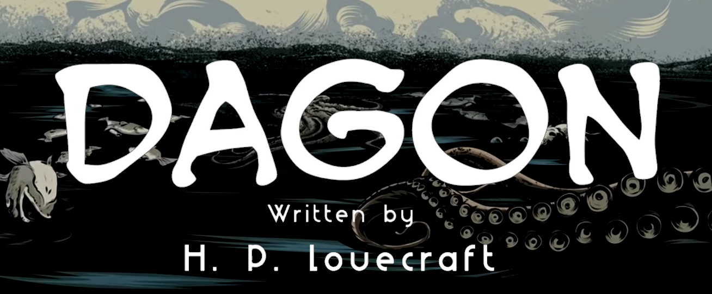

#  Dagon, A Lovecraft Story Skill 

Adaption of Dagon, by H. P. Lovecraft

## About 

This skill brings to you an adaption of Dagon, by H. P. Lovecraft

An illustrated reading of 'Dagon' by H.P. Lovecraft. Read by Mike Bennett, illustrated by Christopher Steininger.
"Dagon" is a short story by American author H. P. Lovecraft. It was written in July 1917 and is one of the first stories that Lovecraft wrote as an adult. It was first published in the November 1919 edition of The Vagrant. Dagon was later published in Weird Tales.

Illustrated by Christopher Edwin Steininger

## Examples 

* "read dagon"
* "play lovecraft video"
* "play dagon"
* "play dagon audio drama"
* "play the dagon video"

# Platform support

- :heavy_check_mark: - tested and confirmed working
- :x: - incompatible/non-functional
- :question: - untested
- :construction: - partial support

|     platform    |   status   |  tag  | version | last tested | 
|:---------------:|:----------:|:-----:|:-------:|:-----------:|
|    [Chatterbox](https://hellochatterbox.com)   | :question: |  dev  |         |    never    | 
|     [HolmesV](https://github.com/HelloChatterbox/HolmesV)     | :question: |  dev  |         |    never    | 
|    [LocalHive](https://github.com/JarbasHiveMind/LocalHive)    | :question: |  dev  |         |    never    |  
|  [Mycroft Mark1](https://github.com/MycroftAI/enclosure-mark1)    | :question: |  dev  |         |    never    | 
|  [Mycroft Mark2](https://github.com/MycroftAI/hardware-mycroft-mark-II)    | :question: |  dev  |         |    never    |  
|    [NeonGecko](https://neon.ai)      | :question: |  dev  |         |    never    |   
|       [OVOS](https://github.com/OpenVoiceOS)        | :question: |  dev  |         |    never    |    
|     [Picroft](https://github.com/MycroftAI/enclosure-picroft)       | :question: |  dev  |         |    never    |  
| [Plasma Bigscreen](https://plasma-bigscreen.org/)  | :question: |  dev  |         |    never    |  

- `tag` - link to github release / branch / commit
- `version` - link to release/commit of platform repo where this was tested

## Credits 
- JarbasAl
- [DAGON by H. P. Lovecraft (youtube)](https://www.youtube.com/watch?v=Gv1I0y6PHfg)

## Category
**Entertainment**

## Tags
#audio 
#books
#radio theatre
#lovecraft
#entertainment
